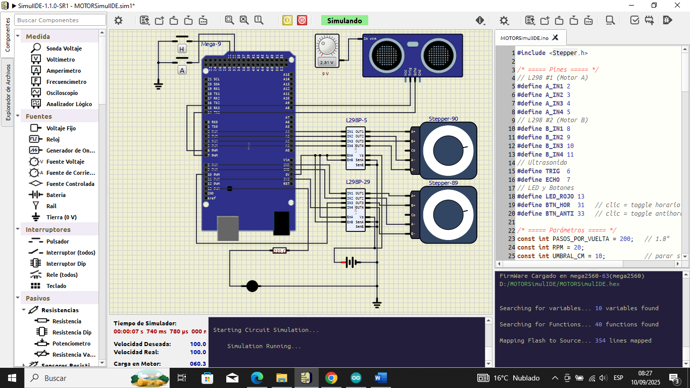

# Portón automático en SimulIDE (Arduino Mega + L298N + HC-SR04)

Prototipo de puerta/portón con dos motores paso a paso y **paro por proximidad**.  
Beneficia a la **Municipalidad del Centro Poblado de Colquijirca** al mejorar la seguridad en accesos.

## Cómo probar
1. Abrir `porton-automatico-simulide/simulacion/MOTORSimulIDE.sim1` en **SimulIDE**.
2. Cargar `porton-automatico-simulide/src/MOTORSimulIDE.ino` en **Arduino Mega 2560**.
3. Abrir el **Monitor Serial a 9600 bps**.
4. Usar pulsadores: **D31** (giro horario) y **D33** (giro antihorario).  
   Si hay **< 10 cm**, los motores **se detienen** y el **LED D13** se enciende.

## Componentes y pines
- **Arduino Mega 2560**
- **2× L298N** (un driver por motor)
- **Sensor ultrasónico HC-SR04**
- **LED** en **D13** y **pulsadores** en **D31/D33** (*INPUT_PULLUP*)
- **Motores:** A → (2, 3, 4, 5) | B → (8, 9, 10, 11)
- **Sensor:** TRIG **D6**, ECHO **D7**

## Funcionamiento
- **BTN31** conmuta giro **horario**; **BTN33** conmuta **antihorario**.
- Si `distancia < 10 cm`, ambos motores **se detienen** y el **LED** **se enciende**.
- Registro por **Serial** cada **200 ms** (distancia y estado).

## Archivos
- `porton-automatico-simulide/simulacion/MOTORSimulIDE.sim1` – Circuito en SimulIDE  
- `porton-automatico-simulide/src/MOTORSimulIDE.ino` – Código Arduino  
- `porton-automatico-simulide/docs/captura.png` – Evidencia de la simulación

